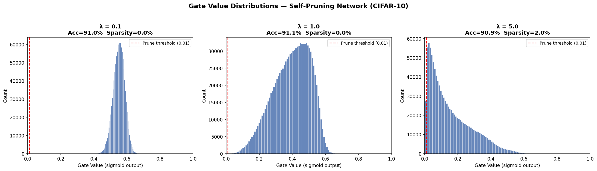
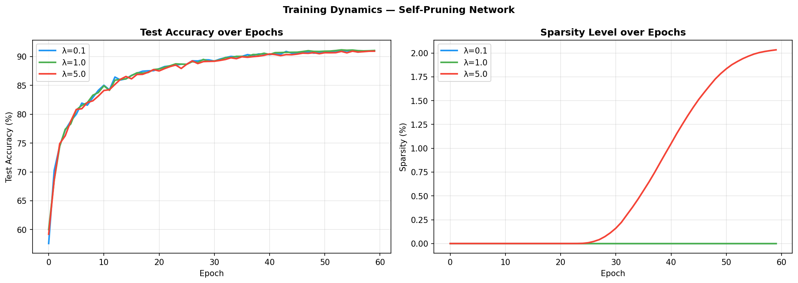

# Self-Pruning Neural Network

Implementation of a neural network that learns to prune its own weights during training using learnable gates and L1 regularization.

---

## Overview

- Custom PrunableLinear layer with learnable gates  
- Gates control whether each weight is active or removed  
- L1 penalty encourages sparsity during training  
- Evaluated on CIFAR-10  

---

## Results

| Lambda | Test Accuracy (%) | Sparsity (%) |
|:------:|:----------------:|:------------:|
| 0.1    | 90.96            | 0.00         |
| 1.0    | 91.06            | 0.00         |
| 5.0    | 90.94            | 2.03         |

Best Accuracy: 91.06% (lambda = 1.0)

---

## Observations

- Increasing lambda increases pruning pressure  
- Most gates reduce in value but do not reach near-zero threshold  
- Accuracy remains stable (~91%) across all runs  
- Strict pruning threshold (1e-2) results in low measured sparsity  

---

## Visualizations

### Gate Distributions

### Training Curves

\
